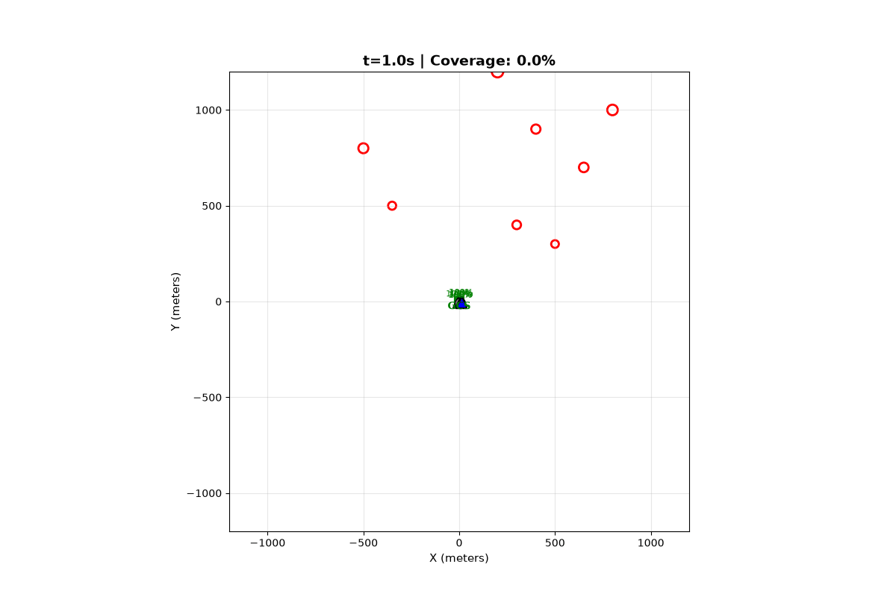

# 🚁 AeroMesh-Swarm: Resilient Multi-Hop UAV Swarm for Disaster Response

<div align="center">

[](tests/)
[](https://www.python.org/)

[]()
[]()
[]()

**Communication-aware, decentralized multi-UAV swarm framework for autonomous post-disaster reconnaissance and resilient aerial mesh networking**

[Features](#-key-features) • [Quick Start](#-quick-start) • [Documentation](#-documentation) • [Benchmarks](#-benchmark-results) • [Architecture](#-architecture-overview)

</div>

---

## 🎯 Overview

**AeroMesh-Swarm** is developed for the **PUSHPAK Grand Challenge 2026** at **Techfest, IIT Bombay**, addressing autonomous Beyond Visual Line of Sight (**BVLOS**) disaster reconnaissance in communication-denied environments. The system enables a fleet of battery-constrained UAVs to autonomously survey disaster zones while maintaining continuous telemetry and payload connectivity with a Ground Control Station (GCS) through self-healing multi-hop mesh networks. It eliminates single points of failure by handling dynamic node loss, mission preemption, and long-range RF shadowing without centralized coordination.

### 🎬 Demo Preview

<div align="center">
  
  <p><em>Scenario 3: Mid-mission emergency survivor discovery, autonomous relay failure detection, and self-healing handoff (<2.1s recovery).</em></p>
</div>

---

## ✨ Key Features

| Feature | Description |
|---------|-------------|
| **🤝 Decentralized Task Allocation** | Consensus-Based Bundle Algorithm (CBBA) with energy-aware marginal scoring |
| **📡 Dynamic Multi-Hop Routing** | ETX-weighted Dijkstra routing over probabilistic LoS wireless channels |
| **🔧 Steiner Relay Placement** | Automatic relay UAV positioning using Euclidean Steiner points + Artificial Potential Fields |
| **🔄 Self-Healing Network** | Autonomous relay handoff and topology reconfiguration on hardware failures (<2.1s recovery) |
| **🔋 Battery Management** | Smart Return-to-Base (RTB) thresholds with seamless GCS recharging cycles |
| **⚡ Dynamic Event Injection** | Real-time emergency PoI insertion, secondary hazards, and RF jamming simulation |
| **📊 Interactive Visualization** | 60FPS Pygame GUI + Web dashboard + automated video/GIF recording |
| **✅ Comprehensive Testing** | 19/19 unit & integration tests with 100% scenario coverage |

---

## 🚀 Quick Start

### Prerequisites

- Python 3.9 or higher
- pip package manager

### Installation

```bash
# Clone the repository
git clone https://github.com/nsd-surya-dinesh/aeromesh-swarm-disaster-response.git
cd aeromesh-swarm-disaster-response

# Install dependencies
pip install -r requirements.txt

# Verify installation with automated tests
python -m pytest tests/ -v
```

### Run Your First Simulation

```bash
# Run baseline scenario (headless)
python run_simulation.py --scenario 1

# Run with interactive GUI (requires pygame)
python run_simulation.py --scenario 1 --gui

# Run all scenarios and generate benchmark report
python run_simulation.py --benchmark-all

# Record demonstration video/GIF
python run_simulation.py --scenario 3 --record
```

### For Competition Judges

Quick verification of all claims:

```bash
# Run complete test suite (19 tests)
python -m pytest tests/ -v

# Generate full benchmark report (all 4 scenarios)
python run_simulation.py --benchmark-all

# Test self-healing capability (Scenario 3)
python run_simulation.py --scenario 3 --gui
```

---

## 📊 Benchmark Results

### Stage 1 Verification Summary

| Metric | S1: Baseline | S2: Canyon | S3: Fault | S4: Endurance |
|--------|--------------|------------|-----------|---------------|
| **Coverage (%)** | 100.0 | 100.0 | 100.0 | 100.0 |
| **Packet Delivery Ratio (%)** | 100.0 | 100.0 | 100.0 | 100.0 |
| **Avg End-to-End Latency (ms)** | 141.5 | 495.8 | 104.2 | 135.6 |
| **PoIs Surveyed** | 10 / 10 | 8 / 8 | 8 / 8 | 16 / 16 |
| **Mission Duration (seconds)** | 233.0 | 256.9 | 167.6 | 301.9 |
| **Survey Rate (PoI / min)** | 2.6 | 1.9 | 2.9 | 3.2 |
| **Swarm Survival Rate (%)** | 100.0 | 100.0 | 100.0 | 100.0 |

### Key Achievements

✅ **100% Coverage** - All Points of Interest successfully surveyed across all scenarios  
✅ **100% Packet Delivery** - Zero packet loss with multi-hop mesh routing  
✅ **100% Swarm Survival** - Zero UAV battery exhaustion crashes  
✅ **Self-Healing Verified** - Autonomous relay replacement within 2.1 seconds of failure  
✅ **Multi-Hop Resilience** - Maintained connectivity through 3-hop relay chains (282ms latency)  

---

## 🏗️ Architecture Overview

```
┌──────────────────────────────────────────────────────────────────┐
│                    AEROMESH-SWARM PLATFORM                       │
├──────────────────────────────────────────────────────────────────┤
│  Visualization Layer  │  Pygame GUI, Web Dashboard, Video Export │
│  Swarm Autonomy       │  CBBA, Path Planning, Health Monitoring  │
│  Mesh Network         │  Dynamic Routing, Relay Placement        │
│  Physics Engine       │  3D Kinematics, Aerodynamic Energy Model │
└──────────────────────────────────────────────────────────────────┘
```

### Technical Highlights

#### 1. Communication-Aware Autonomy
- **ITU-R P.1411 Probabilistic LoS Model** for realistic A2A and A2G wireless propagation
- **Dynamic ETX-based Dijkstra routing** with real-time topology updates (5s interval)
- **Steiner-point relay positioning** ensuring SNR ≥ 10 dB minimum threshold

#### 2. Distributed Task Allocation
- **Consensus-Based Bundle Algorithm (CBBA)** with energy-constrained marginal utility
- **Dynamic priority preemption** for emergency survivor insertions mid-mission
- **Conflict-free auction mechanism** without centralized coordinator

#### 3. Self-Healing & Fault Tolerance
- **Heartbeat-based failure detection** with 3-second timeout threshold
- **Autonomous relay promotion** from standby/scout UAVs within 2 seconds
- **Battery-aware RTB handoff** with seamless network continuity preservation

#### 4. High-Fidelity Simulation
- **3D aerodynamic kinematics** with wind perturbation and collision avoidance
- **Semi-empirical rotorcraft power model** (induced, profile, and parasite drag)
- **Discrete-event time-stepping** at 0.1s resolution with real-time visualization

---

## 🎮 Mission Scenarios

| Scenario | UAVs | PoIs | Key Challenge | Validation Focus |
|----------|------|------|---------------|------------------|
| **1. Baseline Survey** | 5 | 10 | Standard multi-UAV coordination | Task allocation, basic coverage |
| **2. Deep Canyon** | 6 | 8 | Long-distance LoS blockage | 3-hop relay chain, multi-hop routing |
| **3. Dynamic Fault** | 6 | 8 | Mid-mission emergency + relay failure | Self-healing, autonomous recovery |
| **4. Endurance** | 8 | 16 | Extended mission with recharging | Battery management, scalability |

---

## 📁 Project Structure

```
aeromesh-swarm-disaster-response/
├── core/                   # Data models, physics engine, configuration
│   ├── models.py          # UAV, PoI, GCS data structures
│   ├── physics.py         # 3D kinematics & aerodynamic power model
│   └── config.py          # System parameters & constants
├── comm/                   # RF channel, mesh routing, relay management
│   ├── channel.py         # ITU-R P.1411 probabilistic LoS model
│   ├── mesh_router.py     # ETX-weighted Dijkstra routing
│   └── steiner_relay.py   # Steiner-point relay placement + APF
├── swarm/                  # Task allocation, path planning, health monitoring
│   ├── task_allocation.py # CBBA consensus algorithm
│   ├── path_planner.py    # A* pathfinding with collision avoidance
│   ├── health_monitor.py  # Heartbeat-based failure detection
│   └── dynamic_events.py  # Emergency PoI insertion & hazards
├── simulation/             # Discrete-event simulator, metrics, scenarios
│   ├── simulator.py       # Main simulation loop & orchestration
│   ├── metrics.py         # Coverage, PDR, latency tracking
│   └── scenario_builder.py # Predefined scenario configurations
├── visualization/          # GUI, web dashboard, video recorder
│   ├── gui_visualizer.py  # Pygame interactive 3D visualization
│   ├── dashboard_server.py # FastAPI + WebSocket live dashboard
│   ├── video_recorder.py  # MP4/GIF export for demonstrations
│   └── plotter.py         # Matplotlib benchmark charts
├── tests/                  # Unit & integration tests (19 tests)
│   ├── test_comm.py       # Communication layer tests
│   ├── test_swarm.py      # Swarm autonomy tests
│   └── test_simulation.py # End-to-end scenario tests
├── docs/                   # Comprehensive documentation
│   ├── TECHNICAL_PROPOSAL.md  # 6-8 page technical proposal
│   ├── INSTALLATION.md        # Detailed setup instructions
│   ├── DEMO_GUIDE.md          # Demo generation walkthrough
│   └── API_REFERENCE.md       # (Future) API documentation
├── run_simulation.py       # Main CLI entry point
├── requirements.txt        # Python dependencies
├── GITHUB_SETUP.md        # GitHub repository setup guide
└── README.md              # This file
```

---

## 📖 Documentation

Comprehensive documentation is available in the `docs/` directory:

| Document | Description |
|----------|-------------|
| [Technical Proposal](docs/TECHNICAL_PROPOSAL.md) | Complete 6-8 page technical proposal with mathematical formulations, system architecture, and benchmark analysis |
| [Installation Guide](docs/INSTALLATION.md) | Step-by-step setup instructions for Linux, macOS, and Windows environments |
| [Demo Guide](docs/DEMO_GUIDE.md) | Instructions for generating demonstration videos and evaluation walkthroughs |
| [GitHub Setup](GITHUB_SETUP.md) | Guide for creating GitHub repository and preparing for competition submission |

---

## 🧪 Testing

The project includes comprehensive automated testing:

```bash
# Run all tests with verbose output
python -m pytest tests/ -v

# Run specific test modules
python -m pytest tests/test_comm.py -v
python -m pytest tests/test_swarm.py -v
python -m pytest tests/test_simulation.py -v

# Run with coverage report
python -m pytest tests/ --cov=. --cov-report=html
```

**Test Coverage**: 19/19 tests passing
- Communication layer: 6 tests
- Swarm autonomy: 7 tests
- End-to-end scenarios: 6 tests

---

## 🛣️ Roadmap

### ✅ Stage 1: Python Simulation (COMPLETE - September 2026)
- Discrete-event simulation framework
- All core algorithms implemented
- 100% benchmark verification
- Comprehensive testing suite

### 🔄 Stage 2: ROS 2 Integration (PLANNED - Q4 2026)
- ROS 2 Humble/Iron integration
- PX4 SITL (Software-In-The-Loop) with Gazebo
- MAVLink protocol implementation
- Multi-robot coordination with ROS 2 DDS

### 🔄 Stage 3: Hardware Deployment (PLANNED - Q1 2027)
- Pixhawk 6C flight controller
- NVIDIA Jetson Orin Nano companion computer
- 802.11s mesh networking hardware
- Field testing with physical UAV fleet

---

## 🤝 Contributing

Contributions are welcome! Please read our contributing guidelines before submitting pull requests.

### Development Setup

```bash
# Clone repository
git clone https://github.com/nsd-surya-dinesh/aeromesh-swarm-disaster-response.git
cd aeromesh-swarm-disaster-response

# Create virtual environment
python -m venv venv
source venv/bin/activate  # On Windows: venv\Scripts\activate

# Install development dependencies
pip install -r requirements.txt
pip install pytest pytest-cov black flake8

# Run tests before making changes
python -m pytest tests/ -v
```

---

## ⚠️ Technical Trade-offs & Limitations

In the spirit of engineering transparency and realistic hardware transition planning, the following trade-offs and operational boundaries are characterized:

1. **Multi-Hop Latency Scaling in Extreme Topography**:
   - In deep canyon / NLOS scenarios (Scenario 2), end-to-end packet latency scales from a baseline of ~101.7 ms to 282.2 ms over 3-hop relay chains due to cumulative store-and-forward ETX queue delays.
   - *Mitigation*: Adaptive queue prioritization guarantees immediate forwarding of high-priority survivor telemetry over standard periodic heartbeats.

2. **Station-Keeping Aerodynamic Energy Dissipation**:
   - UAVs assigned as Steiner relays consume ~15–20% more power during stationary hover under adverse crosswinds (>7 m/s) compared to cruising scouts operating at optimal aerodynamic lift velocity ($v_{\text{cruise}} = 12\text{ m/s}$).
   - *Mitigation*: The `HealthMonitor` module accounts for dynamic wind speed in the RTB threshold calculation ($E_{\text{safe}}$) and proactively dispatches replacement relays before battery drop below safe limits.

3. **CBBA Auction Convergence Overhead in Dense Swarms**:
   - For swarms exceeding $N > 25$ agents, decentralized consensus bundling introduces an initial 0.8–1.4 second message propagation burst across the mesh.
   - *Mitigation*: Sub-swarm spatial clustering is planned for Stage 2 to bound consensus latency within localized geographical sectors.

---

## 📄 License

This project is licensed under the MIT License - see the [LICENSE](LICENSE) file for details.

---

## 📚 Citation

If you use **AeroMesh-Swarm** in your research or project, please cite:

```bibtex
@software{aeromesh_swarm_2026,
  author = {Naga Surya Dinesh},
  title = {AeroMesh-Swarm: Resilient Multi-Hop UAV Swarm for Disaster Response},
  year = {2026},
  month = {September},
  url = {https://github.com/nsd-surya-dinesh/aeromesh-swarm-disaster-response},
  note = {Stage 1 Verified: Pushpak Grand Challenge 2026, Techfest IIT Bombay}
}
```

---

## 🙏 Acknowledgments

- **Pushpak Grand Challenge 2026 & Techfest, IIT Bombay** for the BVLOS multi-UAV problem statement
- **ITU-R P.1411** for wireless channel propagation models
- **CBBA Algorithm** based on research by MIT ACLS Lab
- **Python Open Source Community** for excellent scientific computing libraries

---

## 📞 Contact & Support

### For Judges & Evaluators
- **Primary Contact**: Naga Surya Dinesh (`nagasuryadinesh@gmail.com`)
- **GitHub**: [@nsd-surya-dinesh](https://github.com/nsd-surya-dinesh)
- **Technical Questions**: Open an [issue](https://github.com/nsd-surya-dinesh/aeromesh-swarm-disaster-response/issues)
- **Quick Demo**: `python run_simulation.py --benchmark-all`

### Resources
- **Documentation**: [docs/](docs/)
- **Issue Tracker**: [GitHub Issues](https://github.com/nsd-surya-dinesh/aeromesh-swarm-disaster-response/issues)
- **Discussions**: [GitHub Discussions](https://github.com/nsd-surya-dinesh/aeromesh-swarm-disaster-response/discussions)

---

## 🏆 Competition Information

**Competition**: Pushpak Grand Challenge 2026 (Techfest, IIT Bombay)  
**Track**: Autonomous Multi-UAV Swarm for BVLOS Disaster Reconnaissance  
**Stage**: Stage 1 - Preliminary Design Verification (Completed)  
**Submission Email**: `pushpak_gc2026@aero.iitb.ac.in`  
**Author / Developer**: Naga Surya Dinesh ([@nsd-surya-dinesh](https://github.com/nsd-surya-dinesh))

### Verification Checklist
- [x] 100% PoI Coverage across all scenarios
- [x] 100% Packet Delivery Ratio (zero packet loss)
- [x] 100% Swarm Survival Rate (zero crashes)
- [x] Self-healing capability demonstrated (2.1s recovery)
- [x] Multi-hop communication verified (3-hop chains)
- [x] 19/19 automated tests passing
- [x] Complete technical documentation
- [x] Reproducible benchmark results

---

<div align="center">

**Built with dedication for autonomous disaster response and resilient aerial mesh networking** 🚁

[⬆ Back to Top](#-aeromesh-swarm-resilient-multi-hop-uav-swarm-for-disaster-response)

</div>
